

	

	
		<h1 class="hero-title brand-title gradient">EPSM</h1>
	

	
Energy Performance Simulation Manager — concise documentation hub for developers and operators.

EPSM helps manage and run EnergyPlus simulations inside containers. Start below:

## Quick Start

- Getting Started: [Setup & Local Development](/GETTING_STARTED.md)
- Development Guide: [Developer Workflow](/DEVELOPMENT.md)
- API Reference: [API Documentation](/API.md)

## Key Guides

- Architecture: [System Overview](/ARCHITECTURE.md)
- Deployment: [Production Guide](/DEPLOYMENT.md)
- Results DB: [Results DB Setup](/RESULTS_DB_SETUP.md)

For full details, use the sidebar to navigate the docs. If you're updating docs or moving pages, see `DOCS_IA.md` in this folder for the migration plan.

## What is EPSM?

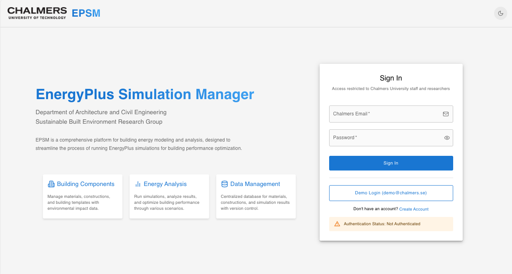
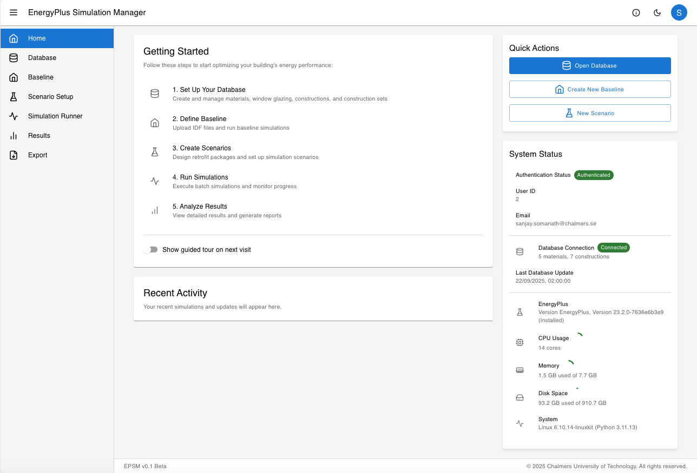
Below are labeled screenshots from the EPSM application with short tutorial notes describing what to do on each screen.

**Login and home**

- EPSM Login Page: Use your Chalmers credentials to sign in. If you're using a local development environment the demo account (demo@chalmers.se / demo123) is available for testing (see Demo Login button). After successful login you'll land on the EPSM home dashboard which summarizes recent simulations and quick actions.
- EPSM Home: The home dashboard provides shortcuts to create new simulations, upload IDF files, and view recent simulation results. Use the left-hand menu to navigate to Materials, Constructions, Scenarios and Simulations.

To get started with EPSM follow these steps to start optimizing your building's energy performance:

1. Set up your database

Create and manage materials, glazing, constructions, and construction sets. Use the Materials list to add or import material properties (density, conductivity, embodied carbon if available). Then compose constructions by assigning layers and thickness.

- Database — Materials overview: shows an index of materials with filters for type, source, and status. Use the "Add material" button to create a new entry or import a CSV for bulk additions (TODO).
	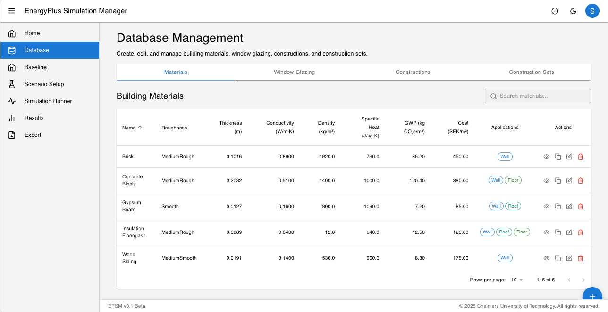

- Database — Materials details: open a material to edit properties and review related constructions that use it. Check that thermal and optical properties match the source data.
	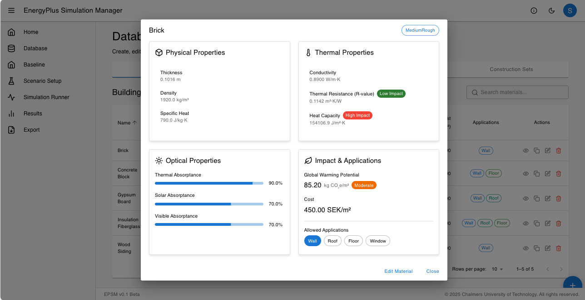

- Database — Construction overview: collections of layers (materials) are shown as constructions. Use the construction editor to reorder layers and preview thermal transmittance (U-value).
	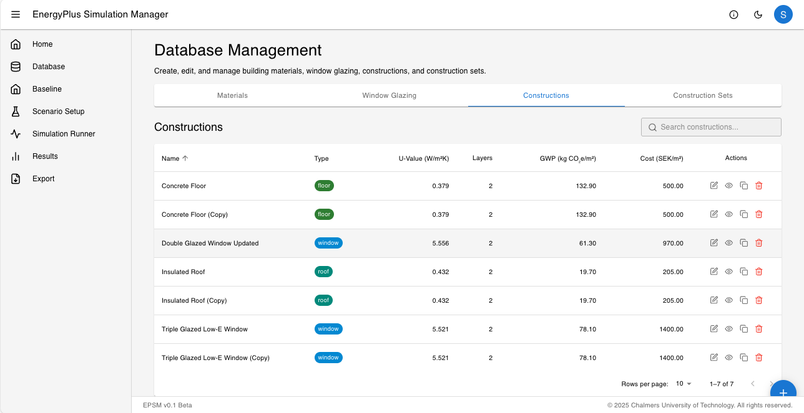

- Database — Construction details: inspect constituent materials in a construction, adjust layer order, and save revised constructions to reuse in templates.
	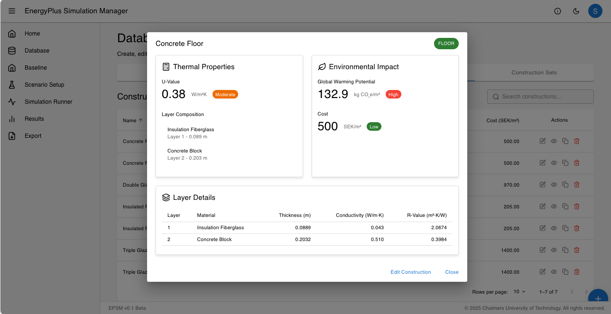

- Construction Set overview: group constructions into sets to apply consistently across building templates and scenarios. Use sets to quickly swap enclosure assemblies when testing retrofits.
	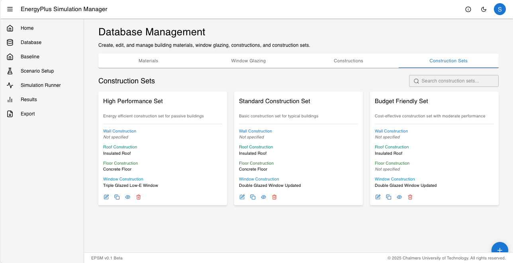
2. Define baseline

Upload one or more EnergyPlus IDF files to create a project baseline. The system extracts materials and constructions from uploaded IDFs so you can reconcile and enrich the model before simulation.

- Baseline — Uploaded materials: After uploading an IDF, review the extracted materials and map them to your database entries to ensure consistency.
	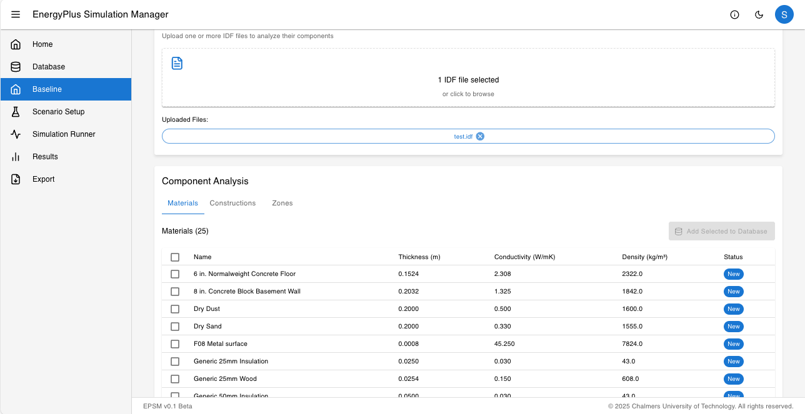

- Baseline — Run baseline simulation: Run the baseline simulation to produce initial performance metrics. After the run completes, inspect energy use, peak loads, and key monthly breakdowns.
	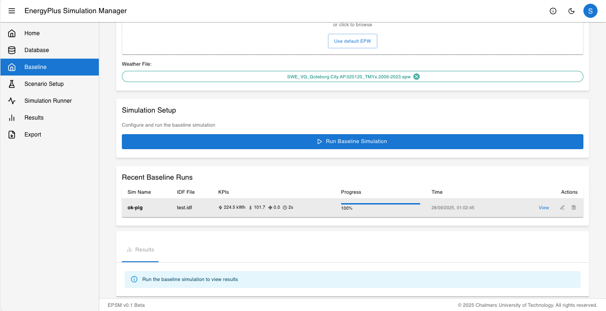

3. Create scenarios

Design retrofit packages by composing construction set swaps, system retrofits, or schedule changes. Each scenario references a baseline model and produces new simulation runs for comparison.

- Scenario — Setup: create a scenario and assign the target construction set or parameter changes. Use the preview to estimate expected savings before running full simulations (TODO).
	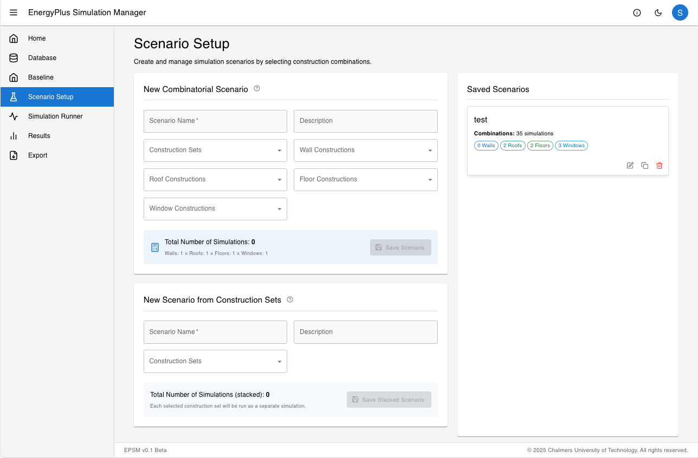
4. Run simulations

Use the Simulation Runner to queue batch runs. Select the scenario, choose the IDF files or building instances to include, and start the job. Monitor progress in the runner UI and cancel or retry failed runs.

- Simulation Runner — Start: choose scenario, inputs and run options. Use parallelism settings to control how many simulations run concurrently.
	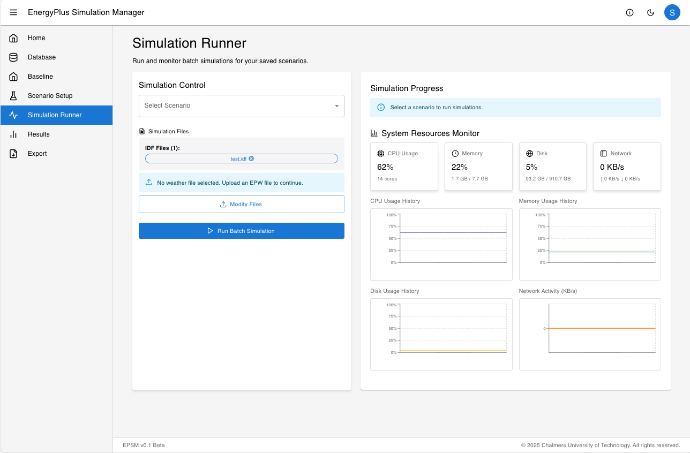
5. Analyze results

After runs complete, open the Results viewer to explore aggregated KPIs, time series, and per-run metrics. Use the UI to compare baseline vs scenario, plot temperature and load profiles, and export CSV or PDF reports.

- Results viewer — Overview: summary of runs with key metrics and quick filters. Click a run to open the detailed view.
	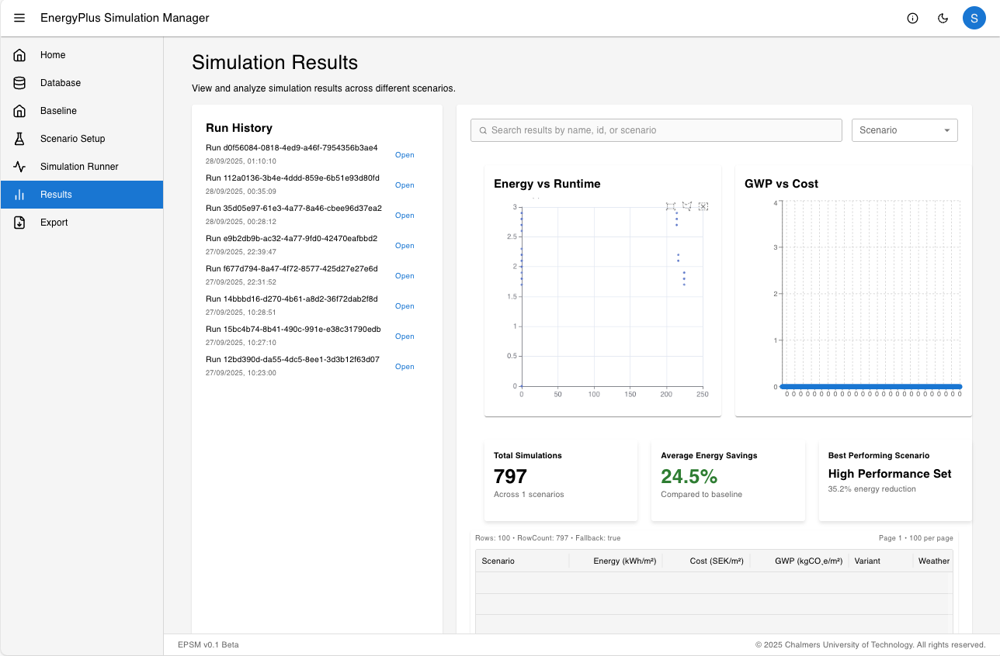

**Tip:** For reproducible comparisons, keep a clear naming scheme for scenarios and document any construction or schedule changes in the scenario notes.